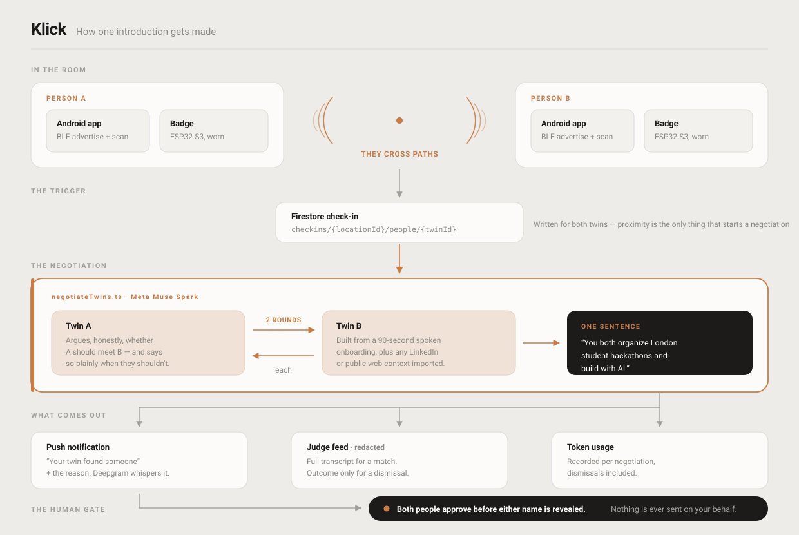
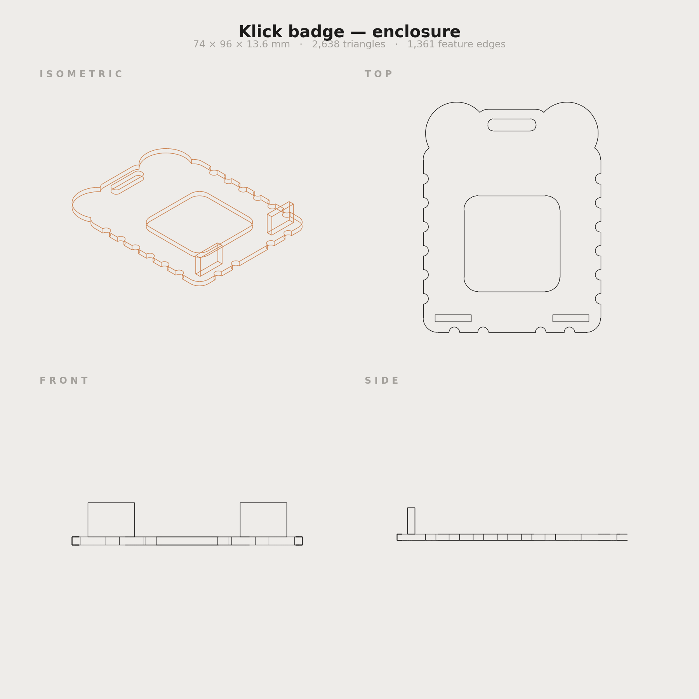

<div align="center">

# Klick

**A thousand people are in this room. Three of them are worth your time.**

Klick builds a digital twin of you from one ninety-second spoken conversation.
When you physically cross paths with someone, the two twins talk it out and
surface one specific reason you should meet — or honestly conclude there isn't one.

*HackMIT 2026 · Meta — "Bringing People Closer Together with AI"*

[Live judge dashboard](https://blades-a38f5.web.app) &nbsp;·&nbsp;
[Architecture](docs/architecture.svg) &nbsp;·&nbsp;
[Design notes](CLAUDE.md)

</div>

---

## The idea

Finding the handful of people worth meeting at a large event costs you the entire
event. Covering a room of a thousand means roughly 200 conversations you will never
have, and the person solving your exact problem was forty feet away on Saturday night.

Klick does the part humans avoid — filtering a thousand strangers, surfacing shared
context, and saying the honest, inconvenient thing when there is no real reason to
meet — and then hands the connection back to a person.

**The twins never decide, never message, and never book.**

## What happens, end to end

| | |
|---|---|
| **1. Build your twin** | A ~90-second spoken conversation. Deepgram transcribes you, Meta's Muse Spark asks the follow-ups. Optionally drop in a LinkedIn PDF or an Instagram handle for extra context. |
| **2. Go about your day** | A foreground service advertises and scans BLE. The badge does the same, from your lapel. Nothing is on screen. |
| **3. Two twins meet** | Crossing paths writes a check-in, which triggers a live LLM-to-LLM negotiation between just those two twins. |
| **4. One specific reason** | *"You both organize London student hackathons and build with AI."* A sentence, never a score. |
| **5. You decide** | Both people approve before either name is revealed. "Say hi" is a tap you make, not a message we send. |

## Why it's cheap

A system that precomputed a global shortlist would reason about **499,500** pairings
for a thousand attendees. Klick gates matching on proximity itself, so it only ever
negotiates between people who actually cross paths — **tens, not thousands.**

Cost scales with foot traffic, not attendance. Every negotiation records its own token
usage, dismissals included, and the live totals are on the
[judge dashboard](https://blades-a38f5.web.app).

## Architecture



| Piece | What it is |
|---|---|
| **Android app** | Kotlin + Jetpack Compose, native. BLE *peripheral* advertising is thin in the cross-platform ecosystems and every phone here must advertise *and* scan, so the one component the demo hinges on is written directly against the platform. |
| **The badge** | ESP32-S3, ESP-IDF, a 3D-printed enclosure. A living nametag that advertises over BLE, reacts when you poke it, and strobes when a match is revealed. |
| **Cloud Functions** | 2nd gen. Stateless turns: each one reads the transcript from Firestore, calls the model, writes back. No long-lived sessions. |
| **Firestore** | State between turns, plus a deliberately redacted `judge_feed` mirror for the public dashboard. |
| **Muse Spark** | Meta's Model API, for both onboarding and twin-to-twin negotiation. Speaks the Anthropic Messages shape, so one thin client covers both call sites. |
| **Deepgram** | Speech-to-text for onboarding, text-to-speech for the twin's replies and the whisper on a match. |

## The badge

A living nametag. It advertises the same BLE token your phone does, so a match can
fire from your lapel with the phone in your pocket — it reacts when poked, and strobes
when a match is revealed.



74 × 96 × 13.6 mm, printed. The enclosure is parametric
(`hardware/box/cad/kindred_badge.py`); regenerate this sheet from the STL with
`python hardware/box/cad/render.py`.

## The guardrails

These are the product, not a policy page. Each one is something you can check:

- **A reason, never a score.** The output is one plain sentence. The numeric threshold
  that gates a match is server-side and is never shown to anyone.
- **Dismissals stay private.** When twins decide there's no reason to meet, the names,
  reasoning and transcript are never published — not even to judges. Open the dashboard
  and click a dismissed pairing; it tells you why it won't show you.
- **Both sides approve before names appear.** Identity is anonymised until two people
  have each said yes.
- **Nothing is sent on your behalf.** No auto-generated intro, no auto-booked meeting.

The reasoning behind each is in [CLAUDE.md](CLAUDE.md).

## Repo layout

```
android/              Kotlin + Compose app (BLE, onboarding, match flow)
functions/            Firebase Cloud Functions (negotiation, voice, context import)
hardware/box/
  firmware/           ESP-IDF badge firmware
  cad/                Badge enclosure — parametric source + STL
judge-dashboard/      Live negotiation view (Firebase Hosting)
submissions/          Track decks and submission copy
docs/                 Architecture diagram
CLAUDE.md             Design decisions and why each one was made
```

## Running it

```bash
# Backend
cd functions && npm install && npm run build
firebase deploy --only functions,hosting

# Android — open android/ in Android Studio, or:
cd android && ./gradlew installDebug

# Badge
cd hardware/box/firmware && ./idf.sh build flash
```

Secrets are Firebase-managed. See `functions/.env.example` and
`hardware/box/firmware/main/secrets.example.h`.

## Built for

**Meta** · Deepgram · Espressif · The Token Company · Ramp · Long Lake

---

<div align="center">
<sub>Your twins found a reason — here it is, want to say hi?</sub>
</div>
